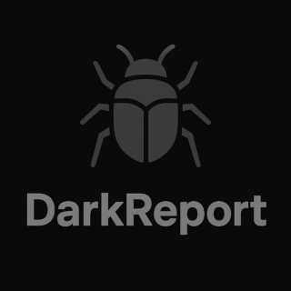

# DarkReport 

DarkReport is reporting vulnerabilities tool. A writeup helper for pentestesters
I write it with Django Framework, with only two goals in mind:
- Make it easy to use.
- Make it fast on doing pentesting reports. 

Features:
   - Django Framework
   - Login required
   - Resume dashboard
   - Export data
   - Priority order for vulns
   - Based on the 7 stages of a cyberattack (But not all required for reports)
     Reconnaissance, weaponizationm, delivery, exploitation, installation, command & control (C2) and actions on objectives 
   - CVEs  https://services.nvd.nist.gov AJAX Integrated API
   - File upload
   - Language locales

## Advise!!
Modify  DEBUG = True to false if you run in production
remember to adjust settings.py for static if you are on production
Run like any django project
``` 
python manage.py runserver
```

## Databases
You have to modify django settings.py file for declare a mysql database, or just use de db.sqlite3 file. 

# Setup admin
``` 
python manage.py shell
```
now in the django shell:
```
>>> from django.contrib.auth.models import User
>>> user = User.objects.create_user(username="admin", password="admin")
```

## Docker deployment
```
docker build -t dark-report .
docker run -p 8000:8000 dark-report
```

## **Under development!!** 
Any contribution will be welcomed 

Version 1.0.1 pmartinezr@proton.me